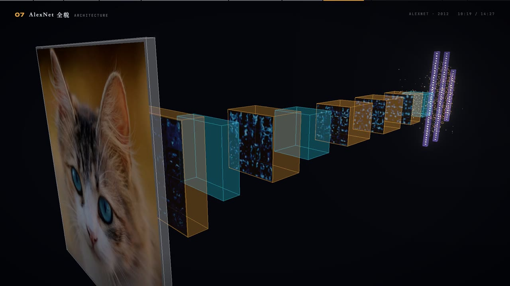
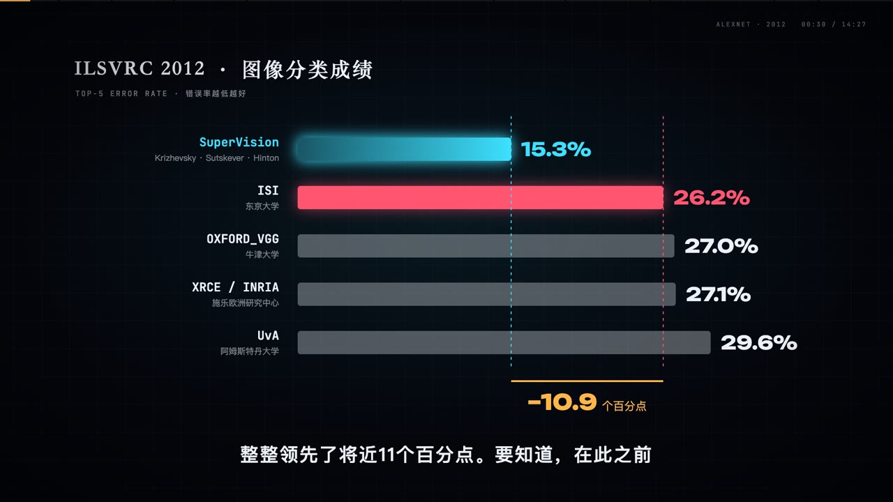
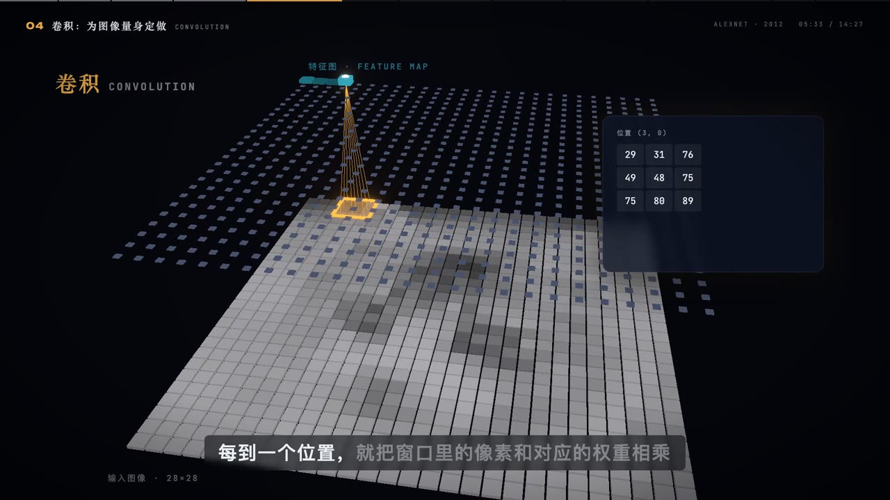
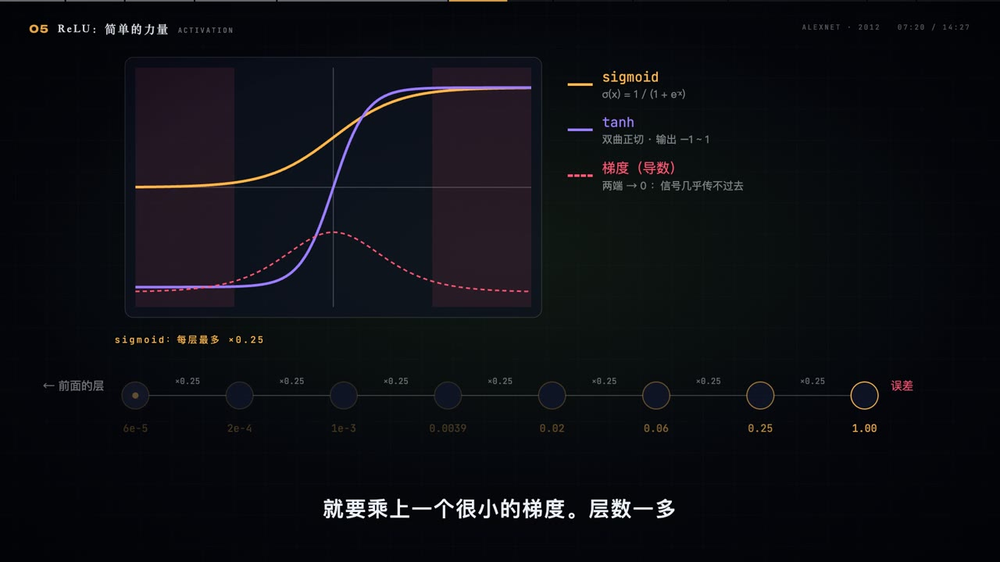
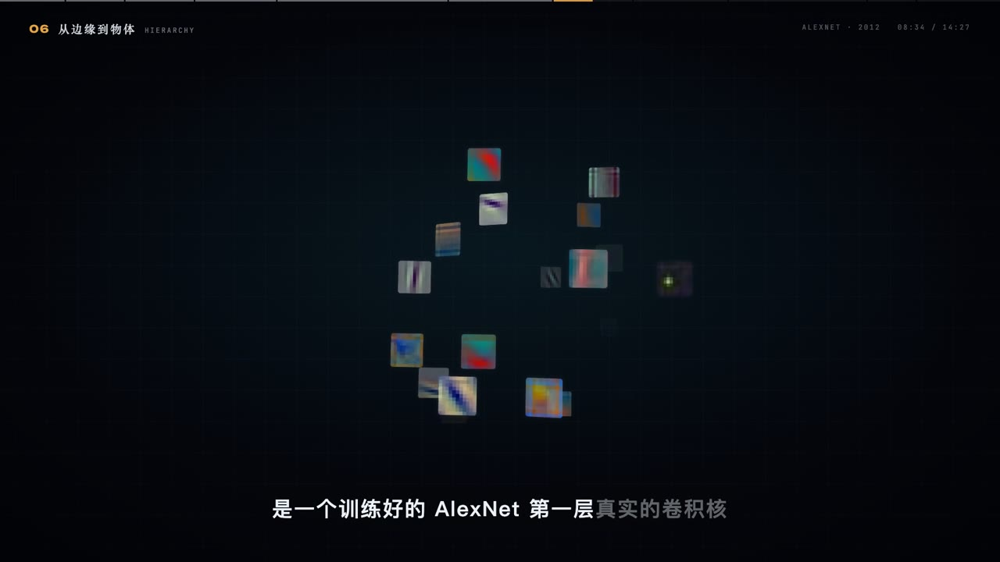
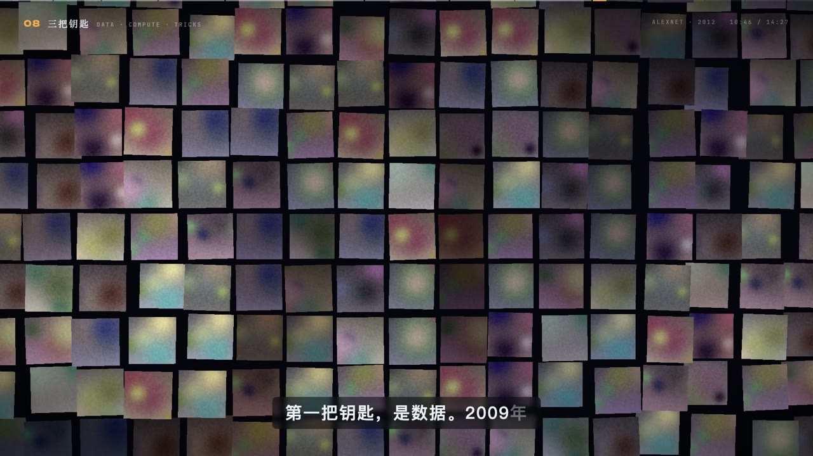

# AlexNet · 深度学习互动课堂

面向深度学习初学者的中文互动教学平台：知识地图、AlexNet 课程动画、暂停探索、测验与本地学习进度。基于 React、Remotion 和 Three.js，可在浏览器运行，也可渲染为 MP4。

OPUS 5.5 宣传短片已独立迁移到 [opus55-codevideo](https://github.com/DuanHangyu/opus55-codevideo)。

## 快速开始

```bash
git clone https://github.com/DuanHangyu/motion-codevideo.git
cd motion-codevideo
npm ci
npm run classroom
```

需要 Node.js 与 npm，以及支持 WebGL 的现代浏览器。项目已包含字体、课程配音、压缩混音和模型可视化资源，启动网页时无需运行 Python、训练模型或调用在线服务。

## AlexNet：一次让机器学会“看”的革命

面向深度学习初学者的中文课程，规格为 1920 × 1080、30 FPS，共 11 个章节。课程通过 RGB 像素、神经元、梯度下降、卷积、ReLU、池化和网络结构逐步解释 AlexNet，结合真实预训练模型的卷积核、特征图与 Grad-CAM 可视化。



### 课程画面

以下画面直接截取自本地渲染完成的 `out/alexnet.mp4`。

| | |
| --- | --- |
|  |  |
| **2012，一场改变方向的比赛** | **局部连接与权重共享** |
|  |  |
| **非线性与梯度传播** | **从边缘到层级特征** |
|  |  |
| **5 个卷积层与 3 个全连接层** | **数据、算力与正则化** |

### 交互课堂怎么用

学习路径是：**输入学习目标 → 知识地图 → 虚拟课堂 → 暂停探索 → 卡片测验 → 掌握度反馈**。

- **知识地图**：16 个节点，包含 10 个可学习节点与 6 个后续主题占位节点；节点之间显示先修关系。
- **虚拟课堂**：播放同一套 Remotion 课程场景，并按知识节点定位课程片段。
- **暂停探索**：在指定片段暂停后，可以进入像素、梯度下降、卷积、激活函数或 AlexNet 结构这 5 个实验台。
- **测验反馈**：4 组测验点、16 道题，结合观看与答题记录更新节点掌握度。
- **本地进度**：保存于浏览器 `localStorage`，不需要账号或数据库。

目前是单课程 MVP，首页根据输入匹配预先编写的深度学习地图；其他主题尚未开放，地图生成过程没有调用大模型。

可直接访问课程或实验台，例如：

```text
http://127.0.0.1:5180/#/lesson/alexnet?node=conv
http://127.0.0.1:5180/#/lesson/alexnet?node=conv&lab=conv
http://127.0.0.1:5180/#/lesson/alexnet?t=326
```

### 实现原理

`src/alexnet/Lesson.tsx` 是课程画面的共同入口：Remotion 离线渲染它得到视频，课堂播放器实时运行它得到网页画面。`src/alexnet/script.json` 保存文案，配音脚本生成逐词时间戳，`cue()` 根据关键词定位画面动作；实验台开启区间和测验点也跟随这份时间轴。

模型数据由 `ml/extract.py` 使用 torchvision 预训练 AlexNet 离线导出到 `public/alexnet/`。网页读取导出的图片和 JSON；像素、卷积、梯度下降等实验在浏览器内计算。教学中的 2012 年原版结构与 torchvision 模型版本有区别，详见 [制作说明](docs/alexnet.md)。

```text
课程文案 → 配音与逐词时间轴 → Remotion 场景 → MP4 / 浏览器课堂
                  │                              │
                  └── 实验区间与测验点 ───────────┤
预训练 AlexNet → 特征图、卷积核、预测与 Grad-CAM ──┘
课堂观看与答题 → 掌握度 → localStorage → 知识地图反馈
```

### 测试与静态部署

```bash
npm run classroom:test
npm exec tsc -- --noEmit
npm run classroom:build
```

构建结果在 `out/classroom/`，可以通过静态服务器运行，无需后端：

```bash
python3 -m http.server 5180 --bind 127.0.0.1 --directory out/classroom
```

运行上述静态服务器前先停止占用 5180 的开发服务。课程使用根路径资源，默认部署在站点根目录；子路径部署需要同步调整资源路径与 Vite 配置。

### 重新制作课程视频

网页所需的 `public/alexnet/mix.m4a` 已提交。高质量 WAV 混音约 238 MB、超过 GitHub 单文件限制，因此与 `out/` 中的 MP4 一起保留在本地，克隆后按以下步骤重新生成。

准备 Python 虚拟环境和 FFmpeg。只重新合成音频时需要 `edge-tts`、`numpy`、`scipy`、`soundfile`；重新导出模型数据时还需要 `torch`、`torchvision`、`pillow` 和 `scikit-image`：

```bash
python3 -m venv .venv
.venv/bin/python -m pip install edge-tts numpy scipy soundfile
# 仅在重新导出模型素材时安装：
.venv/bin/python -m pip install torch torchvision pillow scikit-image

# 可选：重新导出模型可视化数据；首次运行可能下载预训练权重
npm run alexnet:data
# 改文案后运行；在线配音有缓存，只重新生成变更的句子
npm run alexnet:voice
# 生成 WAV、M4A 和音频配置
npm run alexnet:score
npm run alexnet:studio
npm run alexnet:render
```

渲染产物为 `out/alexnet.mp4`。若直接使用仓库中的配音和时间轴，可从 `alexnet:score` 开始。更多章节、素材来源与制作流程见 [docs/alexnet.md](docs/alexnet.md)。

### AlexNet 目录入口

| 路径 | 用途 |
| --- | --- |
| `classroom/` | 首页、知识地图、课堂播放器、实验台、测验与进度 |
| `classroom.vite.config.mts` | 5180 端口、构建与测试配置 |
| `src/alexnet/` | 课程文案、场景、公共组件与生成时间轴 |
| `audio/alexnet/` | 配音、配乐与混音生成 |
| `ml/extract.py` | 预训练模型可视化资源导出 |
| `data/alexnet/` | 原始图像 |
| `public/alexnet/` | 网页与视频共用的模型资源、分句配音与 M4A |
| `docs/images/alexnet/` | README 成片截图 |
