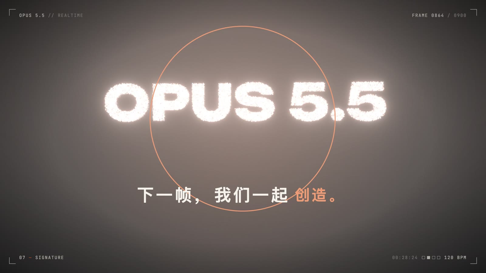
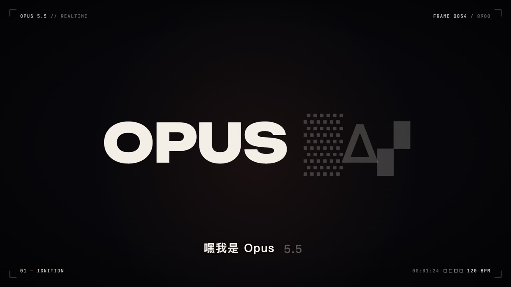
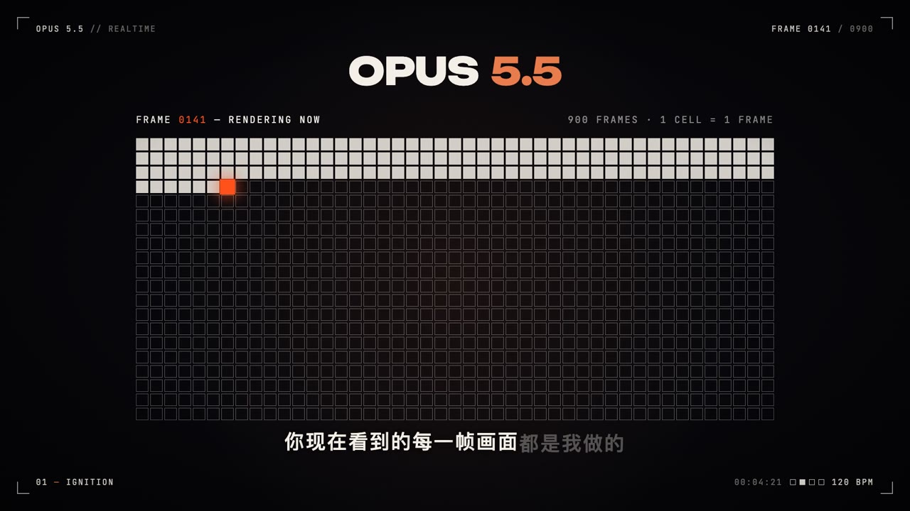
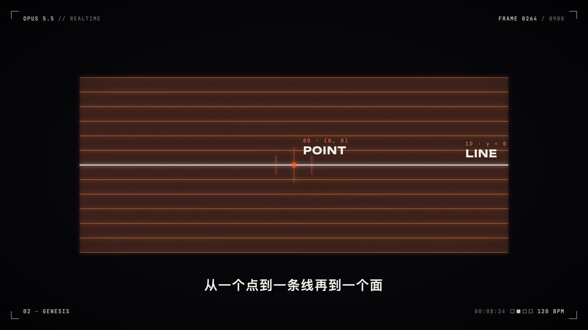
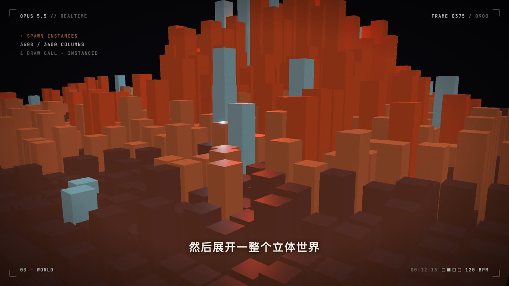
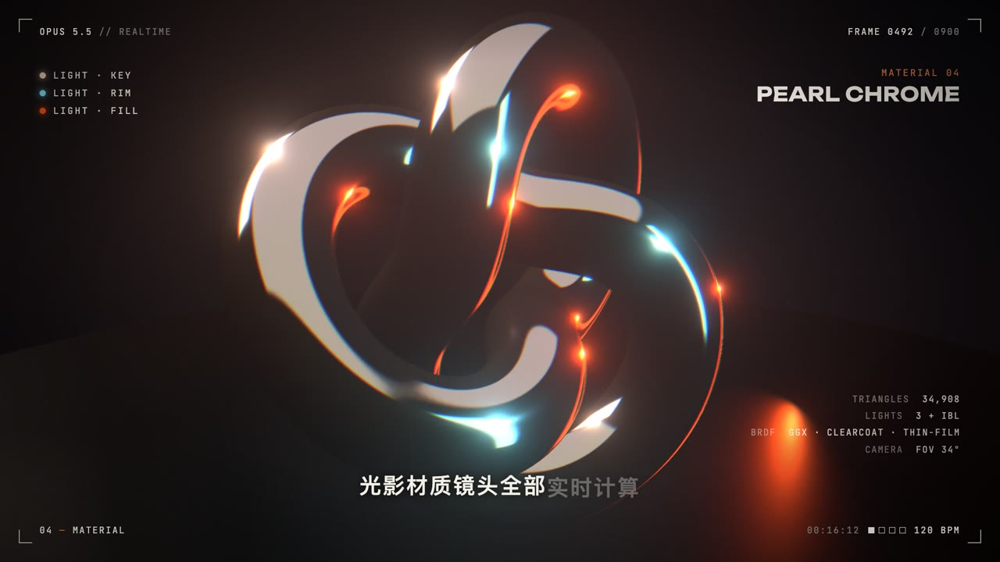
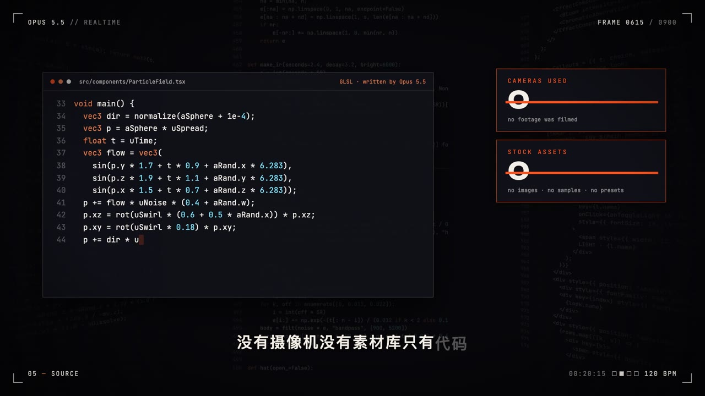
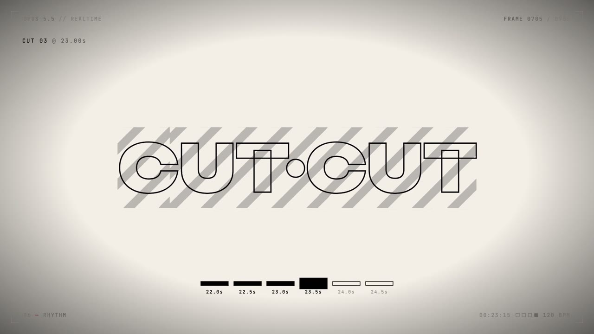
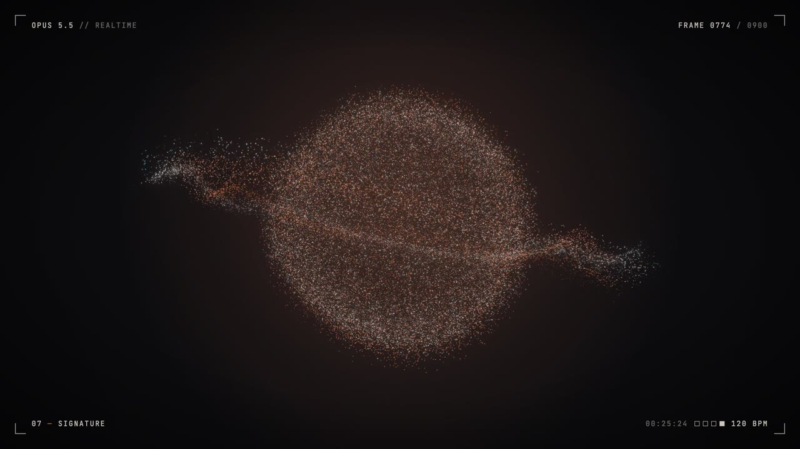

# Motion Codevideo · 可交互的代码视频与虚拟课堂

用 React、Remotion 和 Three.js 将代码变成有声、有动画、可探索的内容。本仓库包含两个作品：**AlexNet 深度学习入门互动课堂**，以及 **OPUS 5.5 代码生成短片**。两者都可以在浏览器中运行，并渲染为 MP4。

| 作品 | 内容 | 本地入口 |
| --- | --- | --- |
| AlexNet 互动课堂 | 14 分 27 秒课程、知识地图、动手实验、测验与掌握度 | `npm run classroom` → `http://127.0.0.1:5180` |
| OPUS 5.5 | 30 秒程序化视听短片与暂停交互 | `npm run web` → `http://127.0.0.1:5178` |

## 快速开始

```bash
git clone https://github.com/DuanHangyu/motion-codevideo.git
cd motion-codevideo
npm ci
npm run classroom
```

需要 Node.js 与 npm，以及支持 WebGL 的现代浏览器。项目已包含字体、课程配音、压缩混音和模型可视化资源，启动网页时无需运行 Python、训练模型或调用在线服务。

## AlexNet：一次让机器学会“看”的革命

面向深度学习初学者的中文课程，规格为 1920 × 1080、30 FPS，共 11 个章节。课程通过 RGB 像素、神经元、梯度下降、卷积、ReLU、池化和网络结构逐步解释 AlexNet，结合真实预训练模型的卷积核、特征图与 Grad-CAM 可视化。


### 课程画面

以下画面直接截取自本地渲染完成的 `out/alexnet.mp4`。

| | |
| --- | --- |
|  |  |
| **2012，一场改变方向的比赛** | **局部连接与权重共享** |
|  |  |
| **非线性与梯度传播** | **从边缘到层级特征** |
|  |  |
| **5 个卷积层与 3 个全连接层** | **数据、算力与正则化** |

### 交互课堂怎么用

学习路径是：**输入学习目标 → 知识地图 → 虚拟课堂 → 暂停探索 → 卡片测验 → 掌握度反馈**。

- **知识地图**：16 个节点，包含 10 个可学习节点与 6 个后续主题占位节点；节点之间显示先修关系。
- **虚拟课堂**：播放同一套 Remotion 课程场景，并按知识节点定位课程片段。
- **暂停探索**：在指定片段暂停后，可以进入像素、梯度下降、卷积、激活函数或 AlexNet 结构这 5 个实验台。
- **测验反馈**：4 组测验点、16 道题，结合观看与答题记录更新节点掌握度。
- **本地进度**：保存于浏览器 `localStorage`，不需要账号或数据库。

目前是单课程 MVP，首页根据输入匹配预先编写的深度学习地图；其他主题尚未开放，地图生成过程没有调用大模型。

可直接访问课程或实验台，例如：

```text
http://127.0.0.1:5180/#/lesson/alexnet?node=conv
http://127.0.0.1:5180/#/lesson/alexnet?node=conv&lab=conv
http://127.0.0.1:5180/#/lesson/alexnet?t=326
```

### 实现原理

`src/alexnet/Lesson.tsx` 是课程画面的共同入口：Remotion 离线渲染它得到视频，课堂播放器实时运行它得到网页画面。`src/alexnet/script.json` 保存文案，配音脚本生成逐词时间戳，`cue()` 根据关键词定位画面动作；实验台开启区间和测验点也跟随这份时间轴。

模型数据由 `ml/extract.py` 使用 torchvision 预训练 AlexNet 离线导出到 `public/alexnet/`。网页读取导出的图片和 JSON；像素、卷积、梯度下降等实验在浏览器内计算。教学中的 2012 年原版结构与 torchvision 模型版本有区别，详见 [制作说明](docs/alexnet.md)。

```text
课程文案 → 配音与逐词时间轴 → Remotion 场景 → MP4 / 浏览器课堂
                  │                              │
                  └── 实验区间与测验点 ───────────┤
预训练 AlexNet → 特征图、卷积核、预测与 Grad-CAM ──┘
课堂观看与答题 → 掌握度 → localStorage → 知识地图反馈
```

### 测试与静态部署

```bash
npm run classroom:test
npm exec tsc -- --noEmit
npm run classroom:build
```

构建结果在 `out/classroom/`，可以通过静态服务器运行，无需后端：

```bash
python3 -m http.server 5180 --bind 127.0.0.1 --directory out/classroom
```

运行上述静态服务器前先停止占用 5180 的开发服务。课程使用根路径资源，默认部署在站点根目录；子路径部署需要同步调整资源路径与 Vite 配置。

### 重新制作课程视频

网页所需的 `public/alexnet/mix.m4a` 已提交。高质量 WAV 混音约 238 MB、超过 GitHub 单文件限制，因此与 `out/` 中的 MP4 一起保留在本地，克隆后按以下步骤重新生成。

准备 Python 虚拟环境和 FFmpeg。只重新合成音频时需要 `edge-tts`、`numpy`、`scipy`、`soundfile`；重新导出模型数据时还需要 `torch`、`torchvision`、`pillow` 和 `scikit-image`：

```bash
python3 -m venv .venv
.venv/bin/python -m pip install edge-tts numpy scipy soundfile
# 仅在重新导出模型素材时安装：
.venv/bin/python -m pip install torch torchvision pillow scikit-image

# 可选：重新导出模型可视化数据；首次运行可能下载预训练权重
npm run alexnet:data
# 改文案后运行；在线配音有缓存，只重新生成变更的句子
npm run alexnet:voice
# 生成 WAV、M4A 和音频配置
npm run alexnet:score
npm run alexnet:studio
npm run alexnet:render
```

渲染产物为 `out/alexnet.mp4`。若直接使用仓库中的配音和时间轴，可从 `alexnet:score` 开始。更多章节、素材来源与制作流程见 [docs/alexnet.md](docs/alexnet.md)。

### AlexNet 目录入口

| 路径 | 用途 |
| --- | --- |
| `classroom/` | 首页、知识地图、课堂播放器、实验台、测验与进度 |
| `classroom.vite.config.mts` | 5180 端口、构建与测试配置 |
| `src/alexnet/` | 课程文案、场景、公共组件与生成时间轴 |
| `audio/alexnet/` | 配音、配乐与混音生成 |
| `ml/extract.py` | 预训练模型可视化资源导出 |
| `data/alexnet/` | 原始图像 |
| `public/alexnet/` | 网页与视频共用的模型资源、分句配音与 M4A |
| `docs/images/alexnet/` | README 成片截图 |

## OPUS 5.5 — Code-Generated Interactive Reel

一个由代码实时生成的 30 秒视听短片，同时也是一个可在浏览器中暂停、逐帧查看和操作 3D 场景的交互式作品。

项目以 **OPUS 5.5** 为主题：画面、镜头、粒子、字幕、音乐、音效和配音时间轴都由程序生成或驱动，不依赖拍摄素材或外部视频素材库。同一套 React 场景既可以通过 Remotion 渲染为 MP4，也可以通过 Vite 作为交互网页运行。

<p align="center">
  
</p>

<p align="center"><sub>70,000 个 GPU 粒子汇聚成 OPUS 5.5——画面截取自实际渲染成片</sub></p>

## 项目是什么

成片规格：

- 时长：30 秒
- 分辨率：1920 × 1080
- 帧率：30 FPS，共 900 帧
- 音乐速度：120 BPM
- 输出形态：H.264 MP4 + 交互式网页
- 视觉技术：React、Remotion、Three.js、React Three Fiber、GLSL、后期处理

它不是把一个现成视频放进网页播放器。网页中的画面仍由 React、Canvas 和 WebGL 按当前帧实时绘制；`out/opus55.mp4` 则是同一套画面的离线渲染版本。

## 当前成品

本地工作目录中已经生成：

- `out/opus55.mp4`：渲染完成的 30 秒视频
- `public/audio/mix.wav`：音乐、音效和人声的最终混音
- `public/audio/vo/`：分句配音及逐词时间信息
- `src/audio-events.json`：鼓点、重拍、转场等视觉同步事件

本地交互版默认运行在：

```text
http://localhost:5178
```

当前的 `5178` 服务是 Vite 开发服务器，只绑定 `127.0.0.1`，因此仅本机可访问。

## 画面预览

以下图片全部直接截取自 `out/opus55.mp4`，不是交互播放器的界面截图。

| | |
| --- | --- |
|  |  |
| **01 · 字符故障开场** | **02 · 900 帧实时矩阵** |
|  |  |
| **03 · 点、线、面逐步生成** | **04 · 3,600 根实例化柱体** |
|  |  |
| **05 · 实时光影与珠光材质** | **06 · 屏幕中的真实项目源码** |
|  |  |
| **07 · 踩在 120 BPM 上的转场** | **08 · 70,000 个 GPU 粒子** |

## 七个章节

| 时间 | 章节 | 内容与技术 |
| --- | --- | --- |
| 0–6s | 开场 | 字符故障动画与 900 帧缩略格；暂停后可以点击格子跳转到对应帧 |
| 6–10s | 点 · 线 · 面 | 用 SVG/DOM 动画依次构成点、线、面和网格 |
| 10–14s | 立体世界 | 3,600 根 Three.js 实例化柱体组成程序化地形；暂停后可旋转、缩放并点击柱体产生波纹 |
| 14–18s | 光影材质 | 环面结、物理材质、环境光源和后期效果；暂停后可切换材质、灯光与观察角度 |
| 18–22s | 只有代码 | 展示项目自身的真实源码，并按人声与打字音效推进 |
| 22–25s | 节拍转场 | 以 120 BPM 的节拍驱动快速排版、遮罩和色块转场 |
| 25–30s | 署名 | 70,000 个 GPU 粒子从球体聚合成“OPUS 5.5”；暂停后鼠标可以拨开粒子 |

时间范围、配音起点和 BPM 的唯一配置入口是 `src/timeline.json`。

## 浏览器交互

播放时，镜头和画面严格按脚本时间推进；暂停后，支持交互的章节会把控制权交给观看者。重新播放时，相机会在约 0.7 秒内平滑回到脚本镜头，暂停时产生的材质选择等临时状态也会交还给时间轴。

快捷键：

| 操作 | 快捷键 |
| --- | --- |
| 播放 / 暂停 | `Space` |
| 前进 / 后退 1 秒 | `→` / `←` |
| 前进 / 后退 1 帧 | `.` / `,` |
| 全屏 | `F` |

底部时间轴可以点击或拖动定位；带 `◆` 的章节表示暂停后可以进入画面交互。

## 实现原理

```text
src/timeline.json
       │
       ├── 场景区间、配音起点、BPM
       │          │
       │          ├── React / Remotion 场景 ──► MP4 离线渲染
       │          │               │
       │          │               └──► Remotion Player ──► 交互网页
       │          │
       │          └── Python 音频生成 ──► mix.wav + audio-events.json
       │                                      │
       └──────────────────────────────────────┘
                          逐帧同步
```

### 1. 一套场景，两种运行方式

`src/Reel.tsx` 是总编排入口。它根据当前帧计算时间，选择七个场景之一，并统一叠加闪白、暗角、颗粒、字幕、HUD 和最终混音。

- `src/Root.tsx` 把 `Reel` 注册为 Remotion Composition，用于离线渲染视频。
- `web/App.tsx` 把同一个 `Reel` 放进 `@remotion/player`，加入播放控制、章节时间轴、键盘快捷键和暂停交互。

因此，MP4 与网页不是两套重复实现，修改场景后两种输出会一起更新。

### 2. 画面是时间的确定性函数

绝大多数动画都由 `useCurrentFrame()` 获取当前帧，再通过 `prog`、`lerp`、缓动函数和节拍脉冲计算视觉状态。Remotion 的带种子 `random()` 用于稳定生成地形和粒子数据，所以相同帧每次渲染都能得到一致结果。

这种设计同时支持：

- 任意帧精确跳转
- 离线多线程渲染
- 浏览器实时播放
- 音频、字幕、镜头与转场的可重复同步

### 3. 音频驱动画面

`audio/tts.py` 使用 `edge-tts` 生成中文女声，并保存逐词边界到 `public/audio/vo/lines.json`。场景通过 `wordAt()` 获取某个词的绝对出现时间，让“点”“线”“面”“光影”“材质”等画面事件精确踩在说话时刻。

`audio/music.py` 使用 NumPy/SciPy 从原始波形合成鼓、贝斯、铺底、琶音和转场音效，再通过 FFmpeg 解码配音、自动压低人声下方的音乐，最终输出：

- `public/audio/mix.wav`：48 kHz、24-bit 立体声混音
- `src/audio-events.json`：kick、clap、hat、hit、tick、stutter 的时间点

画面读取这些事件生成鼓点呼吸、闪白、镜头震动和节拍切换。

### 4. Three.js 与 GPU 动画

立体场景通过 `@remotion/three` 与 React Three Fiber 嵌入 Remotion：

- `World.tsx` 使用 `InstancedMesh` 在一次绘制调用中渲染 3,600 根柱体。
- `Materials.tsx` 使用 `MeshPhysicalMaterial`、IBL、Bloom 和色差处理展示实时材质与灯光。
- `ParticleField.tsx` 使用自定义 GLSL 顶点/片元着色器在 GPU 上驱动 70,000 个粒子，并在结尾把粒子插值为文字采样点。

### 5. 播放态与交互态分离

`src/lib/interactive.ts` 是一个轻量的模块级状态仓库。网页播放器把“是否暂停”和“跳转到某帧”的能力写入其中，场景再按状态决定是否启用 OrbitControls、点击波纹、材质切换和鼠标粒子推力。

离线渲染不会写入这个仓库，所以交互代码不会破坏 MP4 的确定性。

### 6. “只有代码”展示的是真实源码

每次执行 `npm run web`、`npm run studio` 或 `npm run render` 前，`scripts/embed-source.mjs` 会扫描项目的 TypeScript/TSX 与音频 Python 源码，将快照写入 `src/generated/source.json`。代码章节读取这份快照，因此屏幕上滚动的不是装饰性假代码，而是这个项目自身的源码。

## 本地运行

### 环境要求

- Node.js 20 或更高版本
- npm
- 支持 WebGL 的现代浏览器

安装并启动：

```bash
cd "/Users/duanhangyu/Code/motion codevideo"
npm install
npm run web
```

打开 [http://localhost:5178](http://localhost:5178)。端口在 `vite.config.mts` 中使用 `strictPort: true` 固定为 5178；如果端口已被占用，Vite 会直接报错而不会自动换端口。

如果依赖已经严格记录在 `package-lock.json` 中，也可以用：

```bash
npm ci
npm run web
```

## 构建与部署交互网页

可以本地部署，也可以发布为纯静态网站。运行时不需要 Node 后端、数据库或 Python 服务：

```bash
npm run web:build
```

构建结果位于 `out/web/`。可用任意静态文件服务器托管，例如在本机预览生产构建：

```bash
python3 -m http.server 5178 --directory out/web
```

然后访问 [http://localhost:5178](http://localhost:5178)。

> 当前字体和音频使用站点根路径（例如 `/fonts/...`、`/audio/...`）。直接部署在域名根目录即可；如果要部署到 `/some/subpath/`，需要同时调整 Vite 的 `base` 和静态资源路径。

如果希望让同一局域网内的其他设备访问开发服务器，可以临时运行：

```bash
npm run web -- --host 0.0.0.0
```

这会把开发服务暴露给局域网，请只在可信网络中使用。

## 渲染视频

打开 Remotion Studio：

```bash
npm run studio
```

渲染最终 MP4：

```bash
npm run render
```

输出文件为 `out/opus55.mp4`。当前配置使用 H.264、CRF 16、AAC 320 kbps，并以 5 路并发进行渲染。

渲染单帧静态图：

```bash
npm run still
```

## 重新生成配音与音乐（可选）

正常播放、网页构建和视频渲染不需要 Python；仓库中已经包含生成好的音频。只有修改台词、配音或配乐时才需要下面的工具：

- Python 3
- FFmpeg
- Python 包：`edge-tts`、`numpy`、`scipy`、`soundfile`

示例安装：

```bash
python3 -m venv .venv
.venv/bin/python -m pip install edge-tts numpy scipy soundfile
```

重新生成：

```bash
npm run voice
npm run music
```

`npm run voice` 调用在线语音合成服务，因此需要网络。若直连不可用，可以通过 `TTS_PROXY` 环境变量指定代理。`npm run music` 需要先存在七个配音 MP3，并要求系统能够执行 `ffmpeg`。

## 目录结构

```text
.
├── audio/                 # 配音与程序化音乐生成脚本
├── docs/images/           # README 使用的成片高光帧
├── public/
│   ├── audio/             # 网页和视频共用的混音、分句配音
│   └── fonts/             # 本地字体
├── scripts/
│   └── embed-source.mjs   # 把真实源码嵌入“代码”章节
├── src/
│   ├── components/        # HUD、字幕、相机、粒子、氛围效果
│   ├── generated/         # 自动生成的源码快照
│   ├── lib/               # 时间轴、主题、字体与交互状态
│   ├── scenes/            # 七个场景
│   ├── Reel.tsx           # 成片总编排
│   ├── Root.tsx           # Remotion Composition
│   └── timeline.json      # 全局时间轴配置
├── web/                   # Vite 交互播放器界面
├── out/                   # MP4、静态图和网页构建产物（不提交到 Git）
├── remotion.config.ts     # Remotion 渲染配置
└── vite.config.mts        # 交互网页与 5178 端口配置
```

## 常用修改入口

- 调整章节时长、BPM、配音起点：`src/timeline.json`
- 修改台词与声音参数：`audio/tts.py`
- 修改配乐、音效和节拍事件：`audio/music.py`
- 修改场景画面：`src/scenes/`
- 修改全局颜色与字体：`src/lib/theme.ts`
- 修改播放器界面与交互提示：`web/`
- 修改视频尺寸或帧率：`src/Root.tsx` 与 `src/lib/timing.ts`

修改时间轴或台词后，应按顺序重新生成配音、音乐，再渲染视频，以避免字幕、声音和画面不同步。
